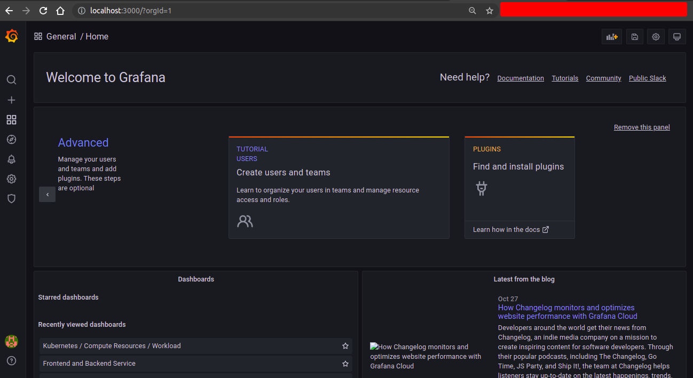
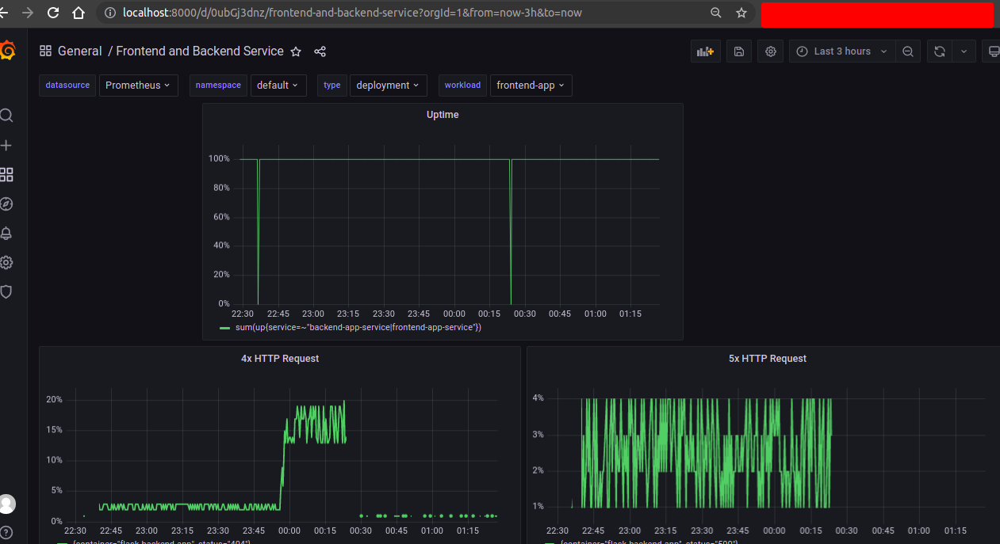

**Note:** For the screenshots, you can store all of your answer images in the `answer-img` directory.

## Verify the monitoring installation
[//]: # ()
*TODO:* run `kubectl` command to show the running pods and services for all components. Take a screenshot of the output and include it here to verify the installation

### Namespace: Default

### Namespace: Monitoring

### Namespace: Observability

## Setup the Jaeger and Prometheus source
*TODO:* Expose Grafana to the internet and then setup Prometheus as a data source. Provide a screenshot of the home page after logging into Grafana.

## Create a Basic Dashboard
*TODO:* Create a dashboard in Grafana that shows Prometheus as a source. Take a screenshot and include it here.

## Describe SLO/SLI
*TODO:* Describe, in your own words, what the SLIs are, based on an SLO of *monthly uptime* and *request response time*.

#### SLI
An SLI is a service level indicator— a *quantitative* measure of some aspect of the level of service that is provided.
#### SLO
An SLO is a service level objective: a target value or range of values for a service level that is measured by an SLI. 
A natural structure for SLOs is thus SLI ≤ target, or lower bound ≤ SLI ≤ upper bound.

#### Example:
**monthly uptime** indicates that how much time a service or application available for the user. 
Here SLO will be our service or application will have the 99% uptime  during next month for the users.
But after next month we found that our service/application uptime was 98%. So our service/application
SLI is 98%. And here SLI< SLO(target)

**request response time** indicates that how much time need our service to execute a user request.
In this case our SLO will be 150 milliseconds  for a single user request and response time for our service. 
But in actual case we found that our service took 160 millisecond for a single request and response. So
160 milliseconds is our SLI.

## Creating SLI metrics.
*TODO:* It is important to know why we want to measure certain metrics for our customer. Describe in detail 5 metrics to measure these SLIs. 

There are several metrics for SLI. We need to choose this metrics for our application base:

  1. Request Latency - The time taken to serve a request (usually measured in ms).
  2. Error Rate - The percentage of requests that are failing (such as percentage of HTTP 500 responses).
  3. System Throughput - Typically measured in requests per second. 
  4. Uptime - The percentage of system availability during a defined period (such as 1 day or 1 month).
  5. Traffic - The amount of stress on a system from demand (such as the number of HTTP requests/second).

## Create a Dashboard to measure our SLIs
*TODO:* Create a dashboard to measure the uptime of the frontend and backend services We will also want to measure to measure 40x and 50x errors. Create a dashboard that show these values over a 24 hour period and take a screenshot.

Here we can easily select our existing namespace, and app.
So we can easily monitor backend and frontend service by selecting the service name and namespace.

## Tracing our Flask App
*TODO:*  We will create a Jaeger span to measure the processes on the backend. Once you fill in the span, provide a screenshot of it here.

[Here is the python file](reference-app/backend/app.py) for trace code. 

## Jaeger in Dashboards
*TODO:* Now that the trace is running, let's add the metric to our current Grafana dashboard. Once this is completed, provide a screenshot of it here.

## Report Error
*TODO:* Using the template below, write a trouble ticket for the developers, to explain the errors that you are seeing (400, 500, latency) and to let them know the file that is causing the issue.

TROUBLE TICKET

Name: [Error on reference-app/backend/app.py](reference-app/backend/app.py)

Date: October 30 2021, 00:29:23.946

Subject: Can to get any response for url "/star"

Affected Area: [reference-app/backend/app.py](reference-app/backend/app.py) line no 47

Severity: Critical

Description: When we hit the backend api with url path "/star" with post request, it produce error and return 500
status code. It may be cause for not properly setting up database.

## Creating SLIs and SLOs
*TODO:* We want to create an SLO guaranteeing that our application has a 99.95% uptime per month. Name three SLIs that you would use to measure the success of this SLO.
To guarantee the success of achieving the SLO for 99.95% application uptime per month, 

Here the SLOs is that our application has 99.95% uptime per month.
To metigate this SLOs we need to take some SLI which ensue that this SLO.

I will measure the "Four Golden Signals", for instance:

  1. Percentage of CPU and memory consumption in the last 1 month (for saturation).
  2. Percentage of Infrastructure uptime in the last 1 month (for error).
  3. The average number of requests per minute in the last 24 hours (for traffic).
  4. Percentage of request response time less than 250 milliseconds (for latency).

We also need some errors budget because all applications will not always work perfectly.
  1. Our application will produce 5xx status code less than 1% in a month
  2. Service downtime will be 0.001% in next month.

## Building KPIs for our plan
*TODO*: Now that we have our SLIs and SLOs, create KPIs to accurately measure these metrics. We will make a dashboard for this, but first write them down here.
To achieve our SLO, I would collect KPIs everyday

  1. CPU consumption should be less than 80%.
  2. Memory consumption should be less than 80%.
  3. Percentage of infrastructure uptime should be higher than 99.99%.
  4. Percentage of request response time less than 500 milliseconds should be higher than 99.99%.
  5. There should not be any 500 errors in the last 1 hour.
  6. Average number of requests per minute should be less than 50.
## Final Dashboard
*TODO*: Create a Dashboard containing graphs that capture all the metrics of your KPIs and adequately representing your SLIs and SLOs. Include a screenshot of the dashboard here, and write a text description of what graphs are represented in the dashboard.

Here
1. CPU utilization for all services about 37% which is less that 80%. 80% is our warning limit.
2. Also there is individual service cpu utilization graph which help us to determine which service
need more CPU.
3. Memory utilization for my cluster is ~72% for all the services where total memory size 4GB.
4. Same as CPU, there is also individual service memory utilization graph. 
5. There is also a service availability metrics, which shows our service availability 100% last one hour. 
6. And our http request metrics show our cluster total http request status. 
7. Here also shows error rate and error status
8. Also shows the request latency.

